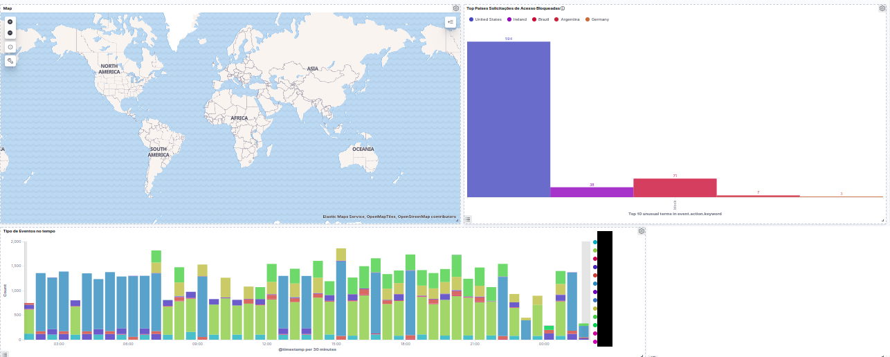

# ELK-pfsense
Observabilidade do pfSense com ELK Stack

## O que é
As ferramentas da Elastic Stack são muito poderosas com seus três principais componentes, o banco de dados não-relacional Elasticsearch, a ferramenta de ETL, o Logstash, a aplicação Web, o Kibana, que consome os dados do Elasticsearch e por ela é possível montar visualização e dashboards. Existem também os agentes da Stack, os Beats, que coletam informações de servidores e serviços e alimentam ou via Logstash, ou diretamente o Elasticsearch, podendo coletar métricas com o Metricbeat, dados de auditoria com o Auditbeat, dados de Logs com o Filebeat, dentre outros Beats que formam a Stack, deixando a ELK Stack ainda mais completa.

## Objetivo
Nesta pipeline utilizamos apenas as três principais ferramentas forneceidas pela Elastic, o Elasticsearch, Logstash e Kibana. No nosso caso de uso, precisariamos capturar os logs do pfSense+OpenVPN para poder analisar os logs dessas aplicações, montando visualizações e dashboards. 

# Requisitos
1. SO server (No caso usei um Centos8)
2. Logstash, Kibana e Elasticsearch instalados.
3. Conta free no Maxmind para o GeoIP

# Executando
Depois de fazer o Download dos arquivos de configuração que estão nas pastas /GeoIP e /pfsense-ELK, vamos criar criar a conta no Maxmind, conforme exige a documentação: https://www.elastic.co/guide/en/logstash/current/plugins-filters-geoip.html, como segue
```
#mkdir /geoip
#cd geoip/
#dnf -y install https://dl.fedoraproject.org/pub/epel/epel-release-latest-8.noarch.rpm 
#wget https://github.com/maxmind/geoipupdate/releases/download/v4.0.0/geoipupdate_4.0.0_linux_amd64.rpm 
#rpm -Uvhi geoipupdate_4.0.0_linux_amd64.rpm
```
Agora, deve-se, no arquivo de configuração em /etc/GeoIP.conf, modifica primeiramente as linhas 7 e 8 para colocar a conta e licença, e linha 13 conforme figura abaixo. 


O próximo passo de configuração do GeoIP são para copiar e iniciar os arquivos na pipeline onde será executado. Depois altera-se o arquivo para a pasta onde ficarão os arquivos do GeoLite2, que aqui foi o /geoip, coforme imagem abaixo e então setaremos o timezone que neste caso foi Fortaleza.
```
#sudo geoipupdate -d /geoip

#sudo vi /etc/cron.weekly/geoipupdate

#sudo timedatectl set-timezone America/Fortaleza
```


E então, na pasta /pfsense-ELK/template tem o arquivo (template) que serve também para o mapeamento GeoIP, que precisa  de um processo de indexação de dados que ocorre no Kibana (que será realizado posteriormente). Neste arquivo, precisa-se alterar o campo “index_pattern” para o pattern criado na interface web do Kibana, no nosso caso, o index foi pfsense-*


Finalmente, deve-se alterar dentro do arquivo /etc/logstash/pipelines.yml, apontando para o local onde se encontram os arquivos necessários da pipeline, no nosso caso /pfsense-ELK/configs/* .conf. Lembrando que é possível ter mais de uma pipeline para logs de serviços diferentes. Após a realização deste passo, basta reiniciar o serviço.
```
#systemctl restart logstash
```


## Dashboards
As dashboards como dito anteriormente são criadas no Kinana e são formadas por várias visualizações. As dashboards mostradas aqui foram exportadas e podem ser utilizadas fazendo o download do arquivo e subindo para a sua Stack.




## Referências
https://www.elastic.co/guide/en/logstash/current/plugins-filters-geoip.html
https://github.com/3ilson/pfelk/
https://www.elastic.co/guide/en/kibana/current/maps.html
https://www.elastic.co/guide/en/logstash/current/plugins-filters-grok.html
https://www.digitalocean.com/community/tutorials/how-to-install-elasticsearch-logstash-and-kibana-elastic-stack-on-centos-7

